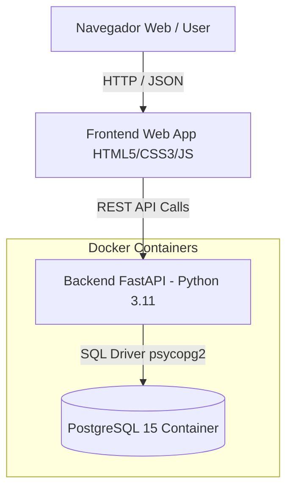

# Documento de Arquitetura — Sprint 1
**Sistema**: Dashboard de Acidentes nas Rodovias Federais (PRF 2025)  
**Projeto Integrado III — UFCA**

---

## 1. Visão Geral da Arquitetura

O sistema adota uma **Arquitetura em Camadas Desacopladas (Client-Server REST)** orientada a microsserviços containerizados via Docker.

---

## 2. Componentes do Sistema

### 2.1 Camada de Apresentação (Frontend)
- **Tecnologias**: HTML5 semântico, CSS3 Vanilla com variáveis de estilo Dark Institucional e JavaScript ES6+.
- **Bibliotecas**:
  - **Leaflet.js**: Renderização de mapa vetorial dark interativo com marcas geolocalizadas por UF.
  - **Chart.js**: Renderização de gráficos dinâmicos (Linha/Área, Rosca, Barras).
- **Responsável**: Victor (Frontend / Scrum Master).

### 2.2 Camada de Serviços (Backend API REST)
- **Tecnologia**: Python 3.11 com framework **FastAPI**.
- **Servidor Web**: Uvicorn ASGI Server.
- **Função**: Prover endpoints REST JSON otimizados para consumo do frontend, abstraindo consultas complexas ao banco de dados com tratamento resiliente e fallback automático.
- **Responsável**: Petrus (Backend / Desenvolvedor).

### 2.3 Camada de Dados (Banco de Dados Relacional)
- **Tecnologia**: **PostgreSQL 15 Alpine**.
- **Função**: Armazenamento persistente, desduplicação de registros, índices de busca rápida e Views otimizadas para o Índice Comparativo de Risco (ICR).
- **Responsável**: Ramon (Banco de Dados / Product Owner).

---

## 3. Topologia de Infraestrutura e Containerização (Docker)

A infraestrutura é declarada via `docker-compose.yml`:
1. **Container `prf_postgres_db`**: Roda a imagem PostgreSQL 15, expõe a porta 5432 e executa automaticamente o script DDL `init.sql`.
2. **Container `prf_backend_api`**: Roda o container Python FastAPI, depende da saúde do PostgreSQL (`service_healthy`) e expõe a porta 8000.
