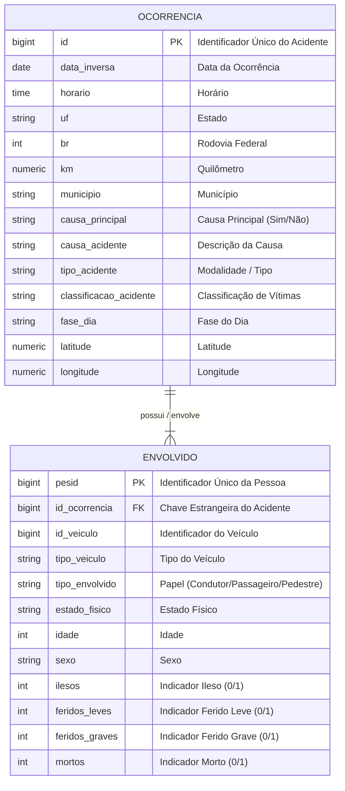

# Modelo Conceitual do Banco de Dados — Sprint 1
**Sistema**: Dashboard de Acidentes nas Rodovias Federais (PRF 2025)  
**Membro Responsável**: Ramon (Banco de Dados / Product Owner)

---

## 1. Descrição do Modelo Entidade-Relacionamento (DER)

O modelo conceitual resolve a regra de negócio crítica onde o arquivo CSV da PRF registra cada pessoa envolvida no acidente, repetindo o identificador do acidente `id`.

Para evitar anomalias de redundância e desduplicar a base, o modelo divide a granularidade em duas entidades fundamentais:

1. **`OCORRENCIA`**: Representa o evento do acidente em si (data, hora, rodovia, município, causas, condições meteorológicas, localização geográfica).
2. **`ENVOLVIDO`**: Representa o indivíduo envolvido no acidente (condutor, passageiro, pedestre), sua condição física (ileso, ferido leve, ferido grave, morto) e o veículo associado.

---

## 2. Diagrama Entidade-Relacionamento (Mermaid ER)

---

## 3. Regra de Negócio: Cardinalidade
- **Relacionamento**: Uma `OCORRENCIA` pode ter 1 ou vários (`1:N`) `ENVOLVIDOS`. Cada `ENVOLVIDO` pertence obrigatoriamente a exatamente 1 (`1:1`) `OCORRENCIA`.
